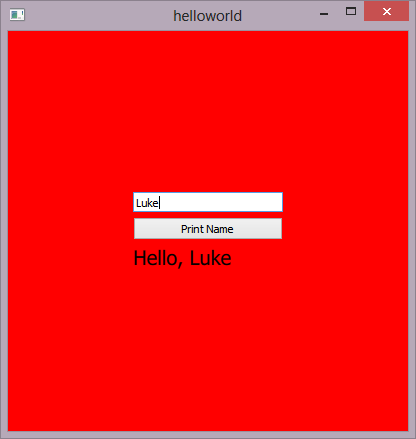

# Hello World
This is a basic example that shows how to call a python function from QML, passing it a string, and returning a string back to QML.

## Instructions
* Build and run the example
* Enter your name and press the button
* A QML Text element will display the string that is returned from the Python function

