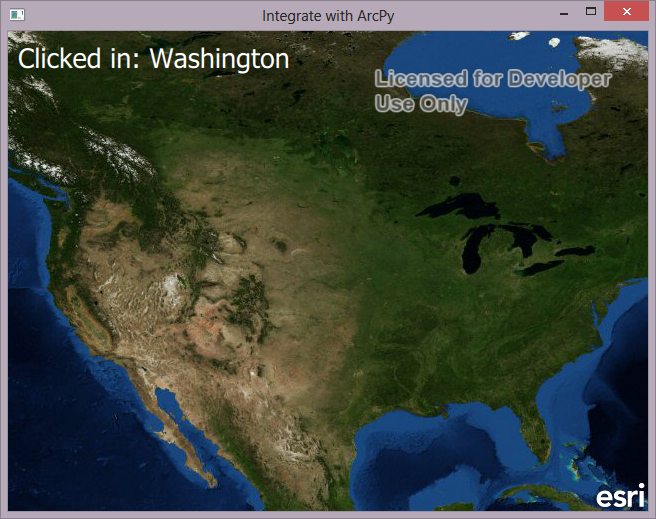

# Integrate with ArcPy and ArcGIS Runtime
This is a basic example that shows how to call ArcPy functions from QML. In this example, a Map with the World Imagery basemap is displayed in QML with the ArcGIS Runtime SDK for Qt. When the map is clicked, the map points are passed into a Python function that determines the U.S. state that the user clicked in. This is done through opening a search cursor on a file geodatabase feature class with arcpy, and using geometry objects and geometry calculations to determine if the given point is within each polygon. The python function returns the name of the polygon it falls within. Because PyOtherSide requires Python 3.3 or greater, ArcPy from ArcGIS Pro must be used (not ArcMap 10.x). It is important to note that this functionality could easily be done all within the ArcGIS Runtime SDK, and would not require the use of ArcPy. This is done simply as a proof of concept to show how scripts that use ArcPy could be called from QML.

## Instructions
* Update the python script to point to the path to the file geodatabase on your machine
* Build and run the example
* Wait for arcpy to initialize
* Click on the map
* A QML Text element will display the name of the state that you clicked in

