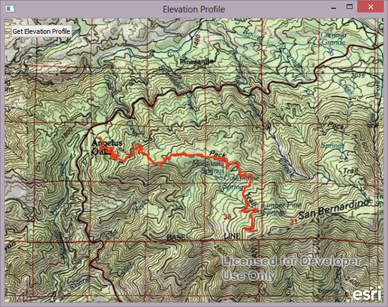
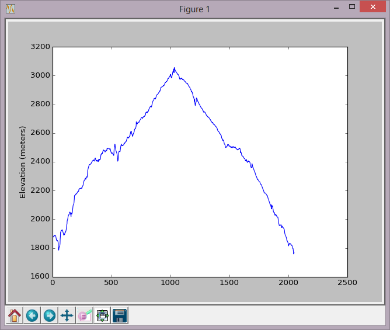

# Elevation profile with matplotlib
This example shows 2 key concepts:

1) How to call other Python packages with PyOtherSide. The workflow does not change, but it is important to note that you can call scripts that utilize matplotlib, NumPy, SciPy, Pandas, and others. QML makes it very easy to provide a user interface for your already existing Python scripts that call different Python packages.

2) How to pass in a QML object that derives from QObject. Most QML objects (including those from the ArcGIS Runtime SDK for Qt) derive from QObject. With PyOtherSide, you can pass down a QObject type to Python and access that object from the Python side. In this example, a QmlPolyline ArcGIS Runtime object is passed into Python, and the json property of that object is accessed. From there, the geometry is parsed for its z values, adding each to a list. This list is then passed into matplotlib to create the plot.

## Instructions
* Build and run the example
* Click the button to get the elevation profile for the polyline
* A window will appear that shows the plot from matplotlib

