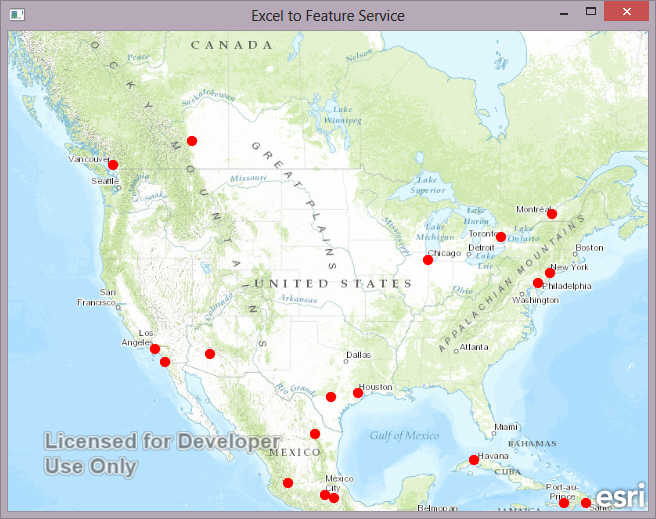

# Excel to Feature Service
This example shows how you can use PyOtherSide to perform tasks that would not be possible in QML. In this case, an Excel spreadsheet is converted to a CSV in Python. This would normally require a new C++ Qt class to be written to do the processing. However, Python has many simple and easy to use libraries that already do this, so it makes sense to take advantage of these. 

This sample uses Python to convert the Excel spreadsheet to CSV. Once this is complete, the ArcGIS Runtime SDK for Qt is used to add the CSV to your AGOL account, publish the CSV as a Feature Service, and then add the resulting feature service to a QML Map.

## Instructions
* Build and run the example
* Sign into your AGOL account. This requires an organizational account (a free developer account will work just fine)
* Click the button and navigate to the provided Excel spreadsheet
* This will begin the Portal calls to Add, Analyze, and Publish the CSV

